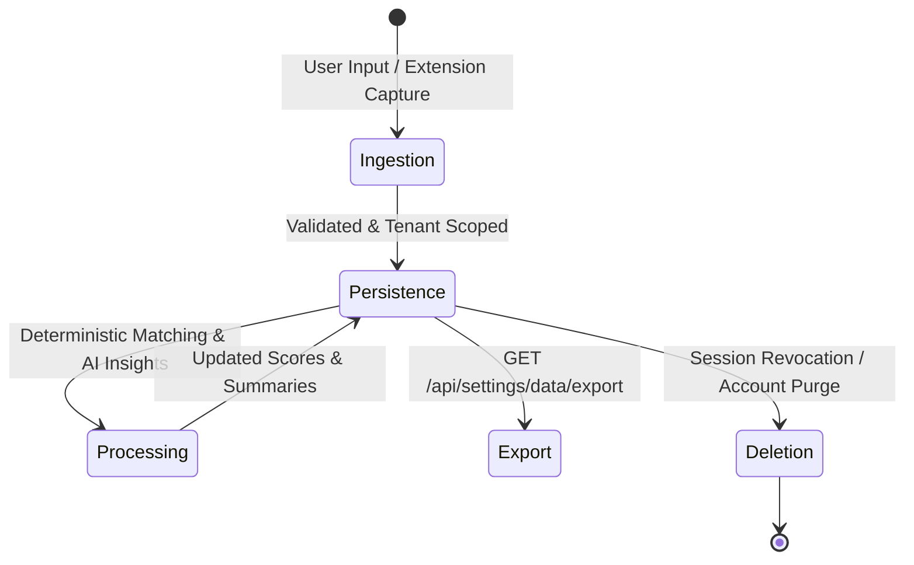

# Technical Data Handling & Architecture Specification

**Document Version**: 1.0.0  
**Target Audience**: Engineering, Security, and Compliance Teams  
**Classification**: Internal Technical Specification

---

## 1. System Data Flow Architecture

FreelanceOS processes user and client data through a strictly layered, tenant-scoped architecture:

```
[Client Surface (Web UI / Extension)]
            │  HTTPS (Encrypted In-Transit)
            ▼
[Authentication Middleware & Session Validator]
            │  Hydrates Authenticated Identity { userId, tenantId }
            ▼
[Application Services & Domain Repositories]
            │  Mandatory owner_id / tenant_id constraints
            ├──────────────────────┬──────────────────────┐
            ▼                      ▼                      ▼
[Database Persistence]   [AI Policy Gateway]   [Export Subsystem]
(Drizzle ORM / Postgres)   (Context Scoped)     (GET /api/settings/data/export)
```

---

## 2. Multi-Tenant Isolation Model

Tenant isolation is enforced server-side through a deterministic ownership model:

1. **Authenticated Identity**: Every authenticated request yields an identity object containing:
   - `userId` (Owner identifier)
   - `tenantId` (`tenant_<userId>`)
2. **Repository-Level Filtering**:
   - All domain repository calls (`clientRepo`, `jobsRepo`, `matchRepo`, `timelineRepo`, `brainAnalysisRepo`) require explicit `ownerId` or `tenantId` arguments.
   - Direct queries execute with equality filters (e.g. `where(eq(jobMatches.tenantId, tenantId))`).
3. **Cross-Tenant Prevention**:
   - Requesting a resource belonging to another tenant returns either `HTTP 404 (Not Found)` or empty result sets, preventing tenant enumeration.

---

## 3. Authentication & Authorization Boundary

- **Session Validation**: Requests pass through session authentication middleware (`checkAuthentication()` in `apps/web/server.js`), validating session tokens against the database `sessions` table.
- **Token Lifetime & Expiry**: Sessions are validated against `expiresAt` timestamps. Expired or revoked sessions return `HTTP 401 Unauthorized`.
- **Privilege Level**: Standard user operations are constrained strictly to the authenticated tenant. Administrative or cross-tenant bypasses do not exist in the domain API layer.

---

## 4. Data Category Mapping

| Data Category             | Ingestion Source    | Processing Purpose                 | Persistence Layer            | Access Boundary    | Export Policy       |
| :------------------------ | :------------------ | :--------------------------------- | :--------------------------- | :----------------- | :------------------ |
| **User Credentials**      | Signup / Auth       | Password authentication            | `user_password_hashes` table | Internal Auth only | **NEVER EXPORTED**  |
| **Active Sessions**       | Login / Device      | Session management & revocation    | `sessions` table             | Authenticated User | **NEVER EXPORTED**  |
| **Client Profiles**       | User Input          | CRM & client relationship tracking | `clients` table              | Tenant / Owner     | **Exported (Full)** |
| **Timeline Events**       | User Input / System | Milestone & communication history  | `timeline_events` table      | Tenant / Owner     | **Exported (Full)** |
| **Ingested Jobs**         | Extension / API     | Job match scoring                  | `job_imports` table          | Tenant / Owner     | **Exported (Full)** |
| **Job Matches**           | Matching Engine     | Fit scoring & recommendations      | `job_matches` table          | Tenant / Owner     | **Exported (Full)** |
| **Brain Analyses**        | AI Gateway          | Client intelligence summaries      | `client_brain_analyses`      | Tenant / Owner     | **Exported (Full)** |
| **Billing Subscriptions** | Stripe Webhooks     | Entitlement enforcement            | `customer_mappings`          | Tenant / Owner     | Stripe ID Only      |

---

## 5. Encryption & Transport Security

- **In-Transit Encryption**: All API, web application, and extension traffic must be served over encrypted HTTPS/TLS in production (_Operational / Deployment Verification Required_).
- **At-Rest Encryption**: Database storage encryption at the filesystem or managed database volume layer (_Operational / Deployment Verification Required_).
- **Password Hashing**: User passwords are encrypted using one-way cryptographic hashing (bcrypt/argon2) with unique per-user salts. Plaintext passwords are never persisted.

---

## 6. Secret Exclusion in Data Exports

The data export engine at `GET /api/settings/data/export` aggregates tenant domain records while strictly omitting sensitive system secrets:

- **Excluded Authentication Data**: `userPasswordHashes`, `sessionTokens`, `refreshTokenHash`, `activeSessions`.
- **Excluded Billing Credentials**: `stripe_secret_key`, `webhook_secret`, raw credit card numbers, payment tokens.
- **Excluded System Secrets**: JWT signing keys, server configuration variables, and environment parameters.

---

## 7. AI Gateway Boundary & Context Redaction

1. **Context Scoping**: The AI Context Builder (`packages/core/src/ai/`) gathers only the client timeline notes, memory entries, and job description explicitly associated with the active `ownerId`.
2. **Context Limits**: Prompts are constrained to pre-configured token bounds to prevent prompt injection and memory exhaustion.
3. **Secret Redaction**: Inputs passing to the AI Gateway are filtered to scrub access tokens, authorization headers, and credential patterns.
4. **Model Training Isolation**: Application-level policies govern that customer prompts and workspace contexts are processed ephemerally and are not submitted for foundation model training.

---

## 8. Chrome Extension Data Handling

The FreelanceOS Job Matcher extension adheres to isolated local processing rules:

- **Execution Boundary**: Injected content scripts execute only on supported URLs (`upwork.com` and `linkedin.com` job detail paths) at `document_idle`.
- **Credential Sanitization**: [`sanitizePrivateData()`](file:///D:/FreelanceAI/apps/extension/src/storage/db.ts#L19-L39) recursively strips `accessToken`, `refreshToken`, `password`, `cookie`, and `authorization` keys prior to local storage.
- **Storage Limits**: IndexedDB storage is capped at 10 snapshots with an individual payload limit of 512 KB.
- **Automated Expiry**: Snapshots expire after 24 hours (`DEFAULT_TTL = 86,400,000 ms`).

---

## 9. Data Lifecycle: Ingestion to Disposal



1. **Ingestion**: Input validated via domain schemas.
2. **Persistence**: Saved with `owner_id` foreign key relationships.
3. **Processing**: Read in-memory with strict tenant filters.
4. **Export**: Serialized into JSON archive via self-service API.
5. **Disposal**: Purged upon session revocation or manual deletion processing.
