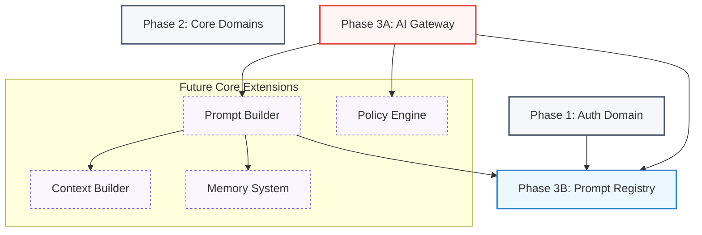
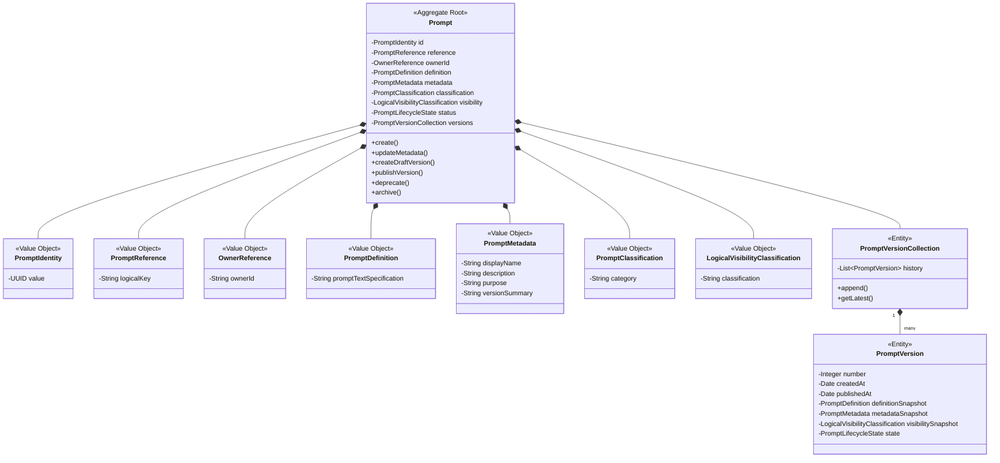
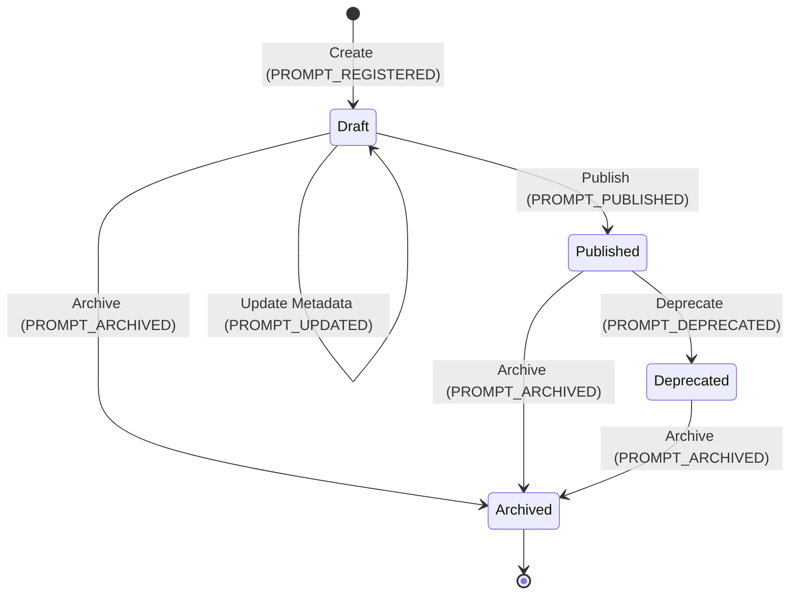
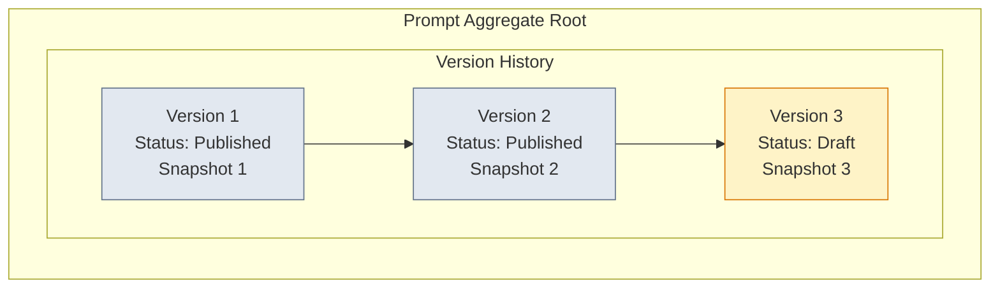
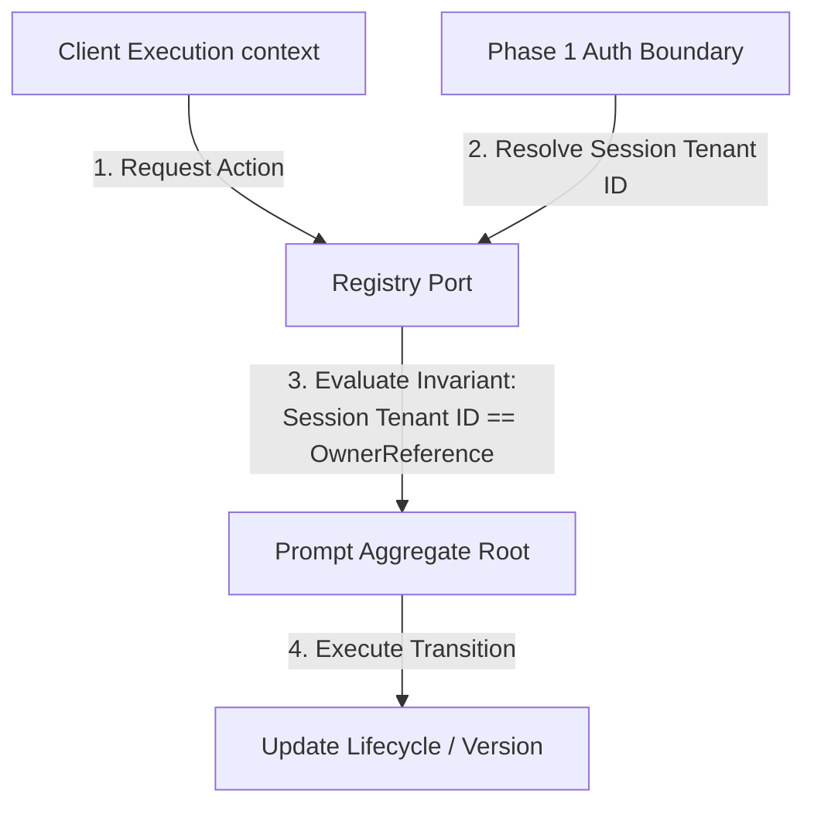
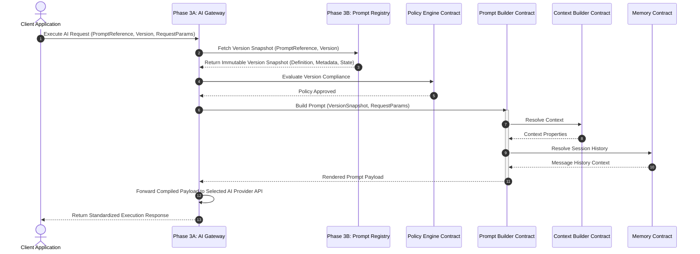

# FreelanceOS Phase 3: Prompt Registry Architecture Blueprint

## Chapter 3B: Prompt Registry Bounded Context (Revised)

---

## 1. Executive Summary

The **Prompt Registry** Bounded Context serves as the authoritative, central repository for managing the definitions, metadata, and lifecycle states of prompts within the FreelanceOS enterprise ecosystem. It functions as a pure metadata and definition catalog, completely decoupled from prompt execution, model evaluation, template compilation, or vendor integration.

### Strategic Objective

The Prompt Registry is designed using Domain-Driven Design (DDD) principles as an isolated domain layer. Its single responsibility is to model the evolution of a prompt specification over time while ensuring structural immutability, strict ownership boundaries, and logical lifecycle management.

### Key Separation of Concerns

- **What it does:** Tracks who owns a prompt, its logical classification, descriptive metadata, logical visibility classification, prompt definition, and append-only version history.
- **What it NEVER does:** Renders text templates, evaluates variables, executes API calls to AI providers, handles retries, parses AI responses, or performs routing/orchestration.

### Integration Compatibility

This blueprint is designed to be fully compatible with:

- **Phase 1 Authentication:** Utilizes abstract owner references validated against authenticated security identities.
- **Phase 2 Core Domains:** Supports domain references linked to Core Entities.
- **Phase 3A AI Gateway:** Operates as a static metadata provider referenced by [`AiRequest`](file:///D:/FreelanceAI/packages/core/src/ai-gateway.ts#L117) contexts.
- **Future AI Components:** Provides the structural baseline for Context Builder, Memory, Embeddings, Prompt Builder, and the Policy Engine.

---

## 2. Prompt Registry Overview

The Prompt Registry resides inside the Enterprise Domain Layer as an independent sub-domain of the FreelanceOS AI systems. It maintains strict boundaries, communicating with external systems only through well-defined, abstract interfaces and publishing domain events when its state changes.

### Architectural Position Block



### Architectural Boundaries

- **Boundary Input:** Request to register, update metadata, publish, deprecate, or archive a prompt, keyed by Owner Reference.
- **Boundary Output:** Immutable metadata, version snapshots, lifecycle state queries, and abstract Domain Events.

---

## 3. Prompt Aggregate

The **Prompt Aggregate** is the boundary of consistency and state transitions for prompt definitions.



### Properties and Types (DDD Abstraction)

1.  **`PromptIdentity`**: Unique identifier for the aggregate root.
2.  **`PromptReference`**: Immutable unique logical string key matching domain taxonomy (e.g., `client.onboarding.welcome`).
3.  **`OwnerReference`**: Immutable reference pointing to the Phase 1 account or organization identifier owning the prompt.
4.  **`PromptDefinition`**: The canonical, immutable prompt specification (representing the structure of the prompt itself, without execution parameters).
5.  **`PromptMetadata`**: Immutable value object mapping details like Display Name, Description, and Purpose.
6.  **`PromptClassification`**: Category marker (e.g., `Sales`, `Support`).
7.  **`LogicalVisibilityClassification`**: The abstract classification of visibility.
8.  **`PromptLifecycleState`**: Current aggregate state (`Draft`, `Published`, `Deprecated`, `Archived`).
9.  **`PromptVersionCollection`**: Contains the internal append-only list of individual versions.

### Mandatory Aggregate Invariants

- **Identity Immutability**: The `PromptIdentity` and `PromptReference` must be defined upon initialization and can never be modified.
- **Ownership Constancy**: The `OwnerReference` is assigned at creation and cannot be updated. Any operation on the aggregate must validate the requesting context against this reference.
- **Append-Only Versioning**: Once a `PromptVersion` is appended and published, it cannot be modified or deleted. Any modification must generate a new version.
- **Published Version Freezing**: A version in the `Published` state is read-only.
- **Strict Lifecycle Pathing**: State transitions must follow the designated state machine flow.
- **Execution Isolation**: The aggregate must not hold references to execution templates, model choices, temperature settings, or routing targets.

---

## 4. Prompt Lifecycle

The logical progression of a prompt from birth to deprecation and archiving.



### Transition Operations and Rules

| Source State   | Destination State | Trigger Operation | Mandatory Conditions / Invariants                                                      |
| :------------- | :---------------- | :---------------- | :------------------------------------------------------------------------------------- |
| **None**       | `Draft`           | `RegisterPrompt`  | Requires a globally unique `PromptReference` and valid `OwnerReference`.               |
| **Draft**      | `Draft`           | `UpdateMetadata`  | The target properties must pass value object validation rules.                         |
| **Draft**      | `Published`       | `PublishPrompt`   | Must generate a new incremented version entry, locking the state of that version.      |
| **Draft**      | `Archived`        | `ArchivePrompt`   | Cancels the draft. Marked as archived, no versions can be created from it.             |
| **Published**  | `Deprecated`      | `DeprecatePrompt` | Discourages use of current version but leaves it readable for active client pipelines. |
| **Published**  | `Archived`        | `ArchivePrompt`   | Prevents the prompt from being retrieved in any active context.                        |
| **Deprecated** | `Archived`        | `ArchivePrompt`   | Permanent lifecycle termination.                                                       |

---

## 5. Prompt States

The Prompt Registry models four primary logical states for prompt aggregates:

1.  **Draft**:
    - **Description**: The prompt definition is undergoing modification, initial registration, or review.
    - **Downstream Access**: Locked. Downstream systems cannot consume drafts.
2.  **Published**:
    - **Description**: The prompt definition has been validated and finalized.
    - **Downstream Access**: Active. Available for loading by downstream contracts.
3.  **Deprecated**:
    - **Description**: A newer prompt reference or version exists. The current prompt is flagged for future retirement.
    - **Downstream Access**: Allowed with warnings. Still accessible to prevent runtime breaking changes in active user loops, but marked for migration.
4.  **Archived**:
    - **Description**: The prompt is logically deleted or retired.
    - **Downstream Access**: Strictly blocked. Retrieval attempts fail with an access error.

---

## 6. Prompt Identity

Prompt Identity is built on three levels of identification to guarantee zero collision and precise ownership isolation.

1.  **System Identifier (`PromptIdentity`)**:
    - An immutable, globally unique system ID (abstracted as a standard v4 UUID wrapper).
    - Used as the primary key within database lookups and domain events.
2.  **Logical Reference (`PromptReference`)**:
    - A domain-scoped human-readable unique string.
    - **Formatting Regular Expression**: `^[a-z0-9]+(\.[a-z0-9]+)*$` (e.g. `workspace.milestone.creation_alert`).
    - Prevents duplication of intent across the registry.
3.  **Owner Identifier (`OwnerReference`)**:
    - Points to the tenant, organization, or user who owns the prompt.
    - Limits querying scope, preventing namespace collision between different tenants.

### Exclusion Rules

Identity structures must **never** contain execution metadata, database keys, server instances, or AI vendor details.

---

## 7. Prompt Metadata Value Object

`PromptMetadata` is designed as a deeply immutable value object. Any metadata changes require generating a completely new instance of `PromptMetadata` and updating the aggregate state (or creating a new version).

### Metadata Structure

```typescript
interface PromptMetadataProperties {
  readonly displayName: string; // Short, user-friendly label (e.g., "Welcome Email Prompt")
  readonly description: string; // Contextual details for developers/managers
  readonly purpose: string; // Business intent or goal (e.g., "Onboard freelance client")
  readonly versionSummary: string; // Changelog description for the specific iteration
}
```

### Strict Forbidden Content

The metadata value object **MUST NOT** hold or specify:

- Prompt text templates (system, assistant, user).
- Variable names, placeholder identifiers, or parameter schemas.
- Model configuration parameters (e.g., temperature, top_p, token budgets, safety thresholds).
- AI Gateway routing instructions or provider preferences.

---

## 8. Prompt Versioning Model

The versioning architecture of the Prompt Registry follows an **Append-Only Snapshot** design.



### Complete Version Snapshot

Every `PromptVersion` is a complete historical artifact and must contain an immutable snapshot of:

- `PromptDefinition` (The canonical, immutable prompt specification)
- `PromptMetadata` (Descriptive user-facing fields)
- `VersionIdentity` (The specific version identifier)
- `PromptLifecycleState` (State of the version)

### Version Evolution Rules

1.  **State Freezing**: When a prompt draft is transition-published, a `PromptVersion` instance is generated with an incremented integer index or Semantic Version string.
2.  **No In-Place Modifications**: A version's properties, metadata snapshot, and status can never be altered once written.
3.  **Branching to Draft**: To edit a prompt, the domain model spawns a new Draft version based on the latest Published version. This Draft can undergo definition and metadata refinement until it is either published (becoming the new active version) or archived.
4.  **No Gaps**: Version progressions are sequential and contiguous.

---

## 9. Prompt Classification

Classification is a logical taxonomy used to catalog, query, and govern prompts within the FreelanceOS workspace.

### Logical Taxonomy Categories

- **Sales**: Client acquisition, lead follow-ups, and proposals.
- **Support**: Helpdesk auto-responders, ticket parsing, and FAQs.
- **Research**: Web search synthesis, market intelligence, and code research.
- **Writing**: Drafting messages, refining proposals, and grammar cleanup.
- **Analysis**: Financial calculations, contract parsing, and timeline projections.

### Separation from Execution Concerns

Classifications do not dictate model execution. For example, labeling a prompt as `Analysis` does not force the AI Gateway to use a reasoning model; model choice remains the responsibility of the downstream prompt builder or gateway routing logic.

---

## 10. Ownership Model

The Registry boundary operates on a trust-but-verify ownership validation model.



### Core Responsibilities

- **Invariant Enforcement**: The Registry guarantees that only commands containing an authenticated user identity matching the `OwnerReference` of the target `Prompt` can modify, transition, or archive it.
- **Auth Decoupling**: The Registry does not perform login checks, validate JWT tokens, or process OAuth permissions. It depends on abstract Phase 1 Auth contracts to supply the verified caller identity context.

---

## 11. Relationships with Future AI Components

The Prompt Registry interacts with downstream components strictly through abstract contracts.

### Component Contracts

1.  **`PromptBuilderContract`**: Interacts with the Prompt Registry to fetch the immutable version snapshot (definition and metadata) to compile executable output.
2.  **`ContextBuilderContract`**: Defines domain context boundaries used by compiling components.
3.  **`MemoryContract`**: Defines session history retrieval interfaces used by compiling components.
4.  **`PolicyEngineContract`**: Evaluates metadata, lifecycle state, and logical classifications against organizational policy rules.

### Interaction Sequence



---

## 12. Domain Events

All status updates and versions are published as abstract Domain Events.

### Standard Lifecycle Events

- `PROMPT_REGISTERED`: Published when a prompt aggregate is first registered in the system (initial state is set to `Draft`).
- `PROMPT_UPDATED`: Published when metadata or definition inside a `Draft` version is modified.
- `PROMPT_PUBLISHED`: Published when a version is successfully finalized and made available.
- `PROMPT_DEPRECATED`: Published when an active version is marked as deprecated.
- `PROMPT_ARCHIVED`: Published when the aggregate state changes to `Archived`.

### Event Implementation Rules

- **Infrastructure Agnostic**: Events are defined using abstract interface contracts, independent of queue brokers.
- **Payload Immutability**: All published event objects must be deeply read-only.

---

## 13. Audit Strategy

The Prompt Registry keeps a history of modifications directly in its aggregate structure to provide audit traceability.

### Audit Design Rules

- **Traceability Chain**: Every state transition inside the Prompt Aggregate must write an entry containing the action name, execution timestamp, and the actor reference executing the command.
- **Event Sourcing Compatibility**: The aggregate version collection history is append-only, meaning the entire history of modifications is preserved. This allows the system state to be reconstructed by replaying actions or events.
- **No Infrastructure Logs**: No console logging dependencies, database files, or file-writer integrations are permitted within the core domain logic.

---

## 14. Security Considerations

To protect prompt metadata and maintain tenant isolation:

- **Tenant Isolation Boundaries**: All database lookup queries and write actions must scope the criteria using `OwnerReference`. It must be impossible to read or write a prompt without validating ownership.
- **Version Integrity**: Database adapter interfaces must prevent updates to existing published version rows. Only inserts of new version indices are allowed.
- **Metadata Integrity**: The metadata value object properties are validated for size and encoding before instantiation to prevent scripting injections or database overflow vectors.

---

## 15. Performance Considerations

All performance plans represent abstract, architecture-level strategies:

- **Read-side Optimization Strategy**: Separating read paths to optimize the lookups of active versions during gateway routing.
- **Write-side Optimization Strategy**: Managing locking constraints on the Prompt aggregate to avoid serialization bottlenecks during version appends.
- **Version Loading Strategy**: Strategies for loading active or specific versions, bypassing unused historical snapshots.
- **Aggregate Loading Strategy**: Lazy-loading version collections during administrative operations vs. direct loading of individual snapshots for gateway execution.

---

## 16. Dependency Matrix

Strict verification of domain boundary isolation.

| Component Name / Library                               | Dependency Status      | Rationale                                                                   |
| :----------------------------------------------------- | :--------------------- | :-------------------------------------------------------------------------- |
| **Packages/Core Base Classes**                         | **Allowed**            | Shares basic exceptions, entity classes, and identity interface designs.    |
| **TypeScript Standard Library**                        | **Allowed**            | Core language constructs and type validations.                              |
| **AI Providers (OpenAI, Anthropic, Gemini, DeepSeek)** | **STRICTLY FORBIDDEN** | The registry manages prompt metadata, not execution.                        |
| **Web Frameworks (Express, Fastify, NestJS)**          | **STRICTLY FORBIDDEN** | Infrastructure concerns must remain outside the Domain Core.                |
| **Database Drivers & ORMs (Postgres, Drizzle, Redis)** | **STRICTLY FORBIDDEN** | Database adapters reside in the Infrastructure layer, not the Domain layer. |
| **Provider SDKs / HTTP Clients**                       | **STRICTLY FORBIDDEN** | Registry does not communicate with external systems or call API endpoints.  |

---

## 17. Definition of Done (DoD)

The Prompt Registry Architecture Blueprint is complete and finalized when:

1.  All 19 defined chapters and design specifications are completed.
2.  All mandatory domain invariants are formally documented.
3.  Sequence and architectural boundaries are defined using Mermaid flowcharts.
4.  No implementation code, HTTP routes, or database configurations are present.
5.  All dependency restrictions are verified.

---

## 18. Review Checklist

- [x] Does the blueprint design ONLY the Prompt Registry?
- [x] Are the prompt identity structures deeply immutable?
- [x] Does the `PromptMetadata` exclude the actual prompt templates, body text, and parameters?
- [x] Is the lifecycle state machine fully mapped out with valid states?
- [x] Are future components represented solely by abstract interfaces?
- [x] Are all AI execution parameters (models, temperature, provider names) excluded from this blueprint?
- [x] Are all design rules compatible with Phase 1, Phase 2, and Phase 3A?

---

## 19. Freeze Criteria

The Prompt Registry Architecture Blueprint is **frozen** upon user confirmation.
Any future implementation of Phase 3B must:

- Inherit the structure of the `Prompt` aggregate as defined.
- Adhere strictly to the append-only versioning rule.
- Respect the isolation boundary, keeping prompt construction and execution logic in downstream builders and gateways.
- Reject any attempt to add vendor SDK dependencies to the registry codebase.
