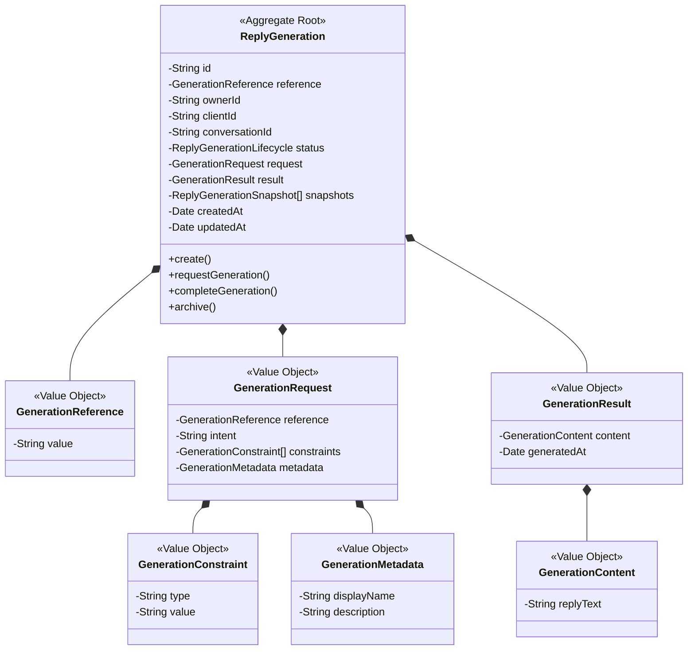
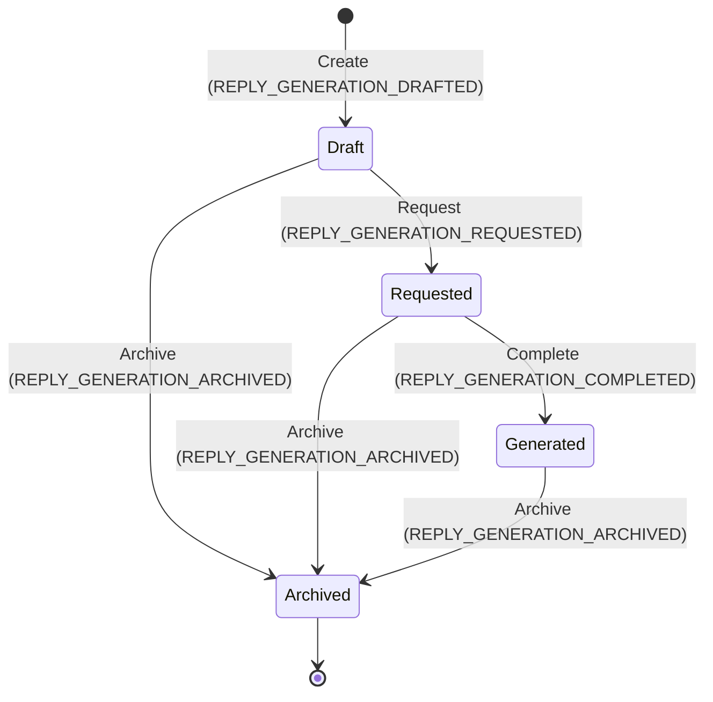

# Chapter 7A — Reply Studio / Generation

## 1. Purpose

The purpose of Chapter 7A (Reply Studio — Generation) is to establish the core domain model and strategic contract for reply generation. It governs the lifecycle of a draft reply request, compiles specific logical formatting constraints, stores the generated output from model inference, and publishes domain events tracking lifecycle transitions.

---

## 2. Domain Responsibility

Chapter 7A holds the single logical responsibility of modeling the lifecycle and state transitions of reply generation requests.

- **Request Management**: Ensuring valid inputs, identifiers, and constraints are registered.
- **Logical Constraints**: Managing length and formatting constraints for the generated response.
- **Result Storing**: Representing the immutable output of a successful generation event.
- **Lifecycle Management**: Transitioning state from a draft request through final generation while maintaining strict validation.
- **State History**: Creating immutable historical snapshots of each transition.
- **Domain Events**: Emitting status changes for downstream orchestration and audit logging.

---

## 3. Non-Responsibilities

Chapter 7A is strictly decoupled from the following operational concerns, which belong to either sibling chapters, other packages, or the infrastructure layer:

- **AI Provider Execution**: Core domain does not communicate with LLMs, format provider payloads, handle network retries, or read API keys.
- **Rewrite & Iteration (7B)**: The revision, history, or strategy of modifying an existing generated reply is outside the scope of 7A.
- **Tone Adjustment (7C)**: Dynamic tone classification, scoring, or transformation is owned by 7C.
- **Grammar & Spellchecking (7D)**: Fixing language mechanics is owned by 7D.
- **Client Context Assembly (Phase 4)**: The domain does not compile summaries or memory updates.
- **Vector Search & Context Retrieval (Phase 5)**: Finding relevant facts or embedding text is owned by Phase 5.
- **Scope Rules & Pricing (Phase 6)**: Defining business rules, confidence levels, or pricing quotes is owned by Phase 6.

---

## 4. Aggregate Boundary

The consistency boundary for Chapter 7A is defined by the `ReplyGeneration` aggregate root.



---

## 5. Domain Model

The `ReplyGeneration` class acts as the aggregate root, enforcing all invariants and coordinating modifications to its internal state.

### Core Fields and Schema:

- `id`: `string` — A globally unique UUID identifying the generation aggregate.
- `reference`: `GenerationReference` — The unique human-readable identifier scoped to the tenant workspace.
- `ownerId`: `string` — The identifier of the authenticated security context owning this aggregate.
- `clientId`: `string` — A logical reference to the target client aggregate.
- `conversationId`: `string` — A logical reference to the conversation context.
- `status`: `ReplyGenerationLifecycle` — The current operational state of the aggregate.
- `request`: `GenerationRequest` — Value object representing the request parameters.
- `result`: `GenerationResult | undefined` — Value object containing the generated content, present only after successful completion.
- `snapshots`: `ReplyGenerationSnapshot[]` — Append-only version history.
- `createdAt`: `Date` — Date when the aggregate was created.
- `updatedAt`: `Date` — Date of the latest status transition.

---

## 6. Value Objects

All value objects in the domain must be deeply immutable, utilizing `Object.freeze(this)` on construction and performing defensive copies for all dates.

### 1. `GenerationReference`

- **Purpose**: Scoped workspace identifier.
- **Fields**: `value: string`
- **Validation**: Must be a non-empty trimmed string matching the dot-separated regular expression `/^[a-z0-9]+([.-][a-z0-9]+)*$/`.

### 2. `GenerationConstraint`

- **Purpose**: Governs formatting and length output boundaries.
- **Fields**: `type: string`, `value: string`
- **Validation**:
  - `type` must be exactly `"length"` or `"format"`.
  - For type `"length"`, value must be `"short"`, `"medium"`, or `"long"`.
  - For type `"format"`, value must be `"plain-text"` or `"markdown"`.

### 3. `GenerationMetadata`

- **Purpose**: Documentation metadata for the user interface.
- **Fields**: `displayName: string`, `description: string`
- **Validation**: Both fields must be trimmed non-empty strings.

### 4. `GenerationContent`

- **Purpose**: Structural text storage of generated output.
- **Fields**: `replyText: string`
- **Validation**: Must contain a non-empty string. Must exclude rich formatting engines, HTML tags, or token metadata.

---

## 7. Generation Request

The `GenerationRequest` is an immutable value object initialized upon aggregate creation.

### Fields:

- `reference`: `GenerationReference`
- `intent`: `string` — Describing the tactical purpose of the reply (e.g. `"Follow up on proposal timeline"`).
- `constraints`: `GenerationConstraint[]`
- `metadata`: `GenerationMetadata`

### Validation Rules:

- Must validate each nested value object individually.
- `constraints` collection must be deep-copied and frozen using `Object.freeze(this._constraints)` to prevent runtime array mutations.

---

## 8. Generation Result

The `GenerationResult` represents the completed generated reply content.

### Fields:

- `content`: `GenerationContent`
- `generatedAt`: `Date`

### Validation Rules:

- `generatedAt` must be defensively copied during constructor assignment and getter retrieval.
- Must exclude any provider execution information such as token usage, inference latency, provider identity (e.g., OpenAI, Gemini), or model parameters.

---

## 9. Content Semantics

- `GenerationContent` stores text representation inside the `replyText` field.
- HTML tags are strictly prohibited. Plain text or Markdown representations (based on constraints) are permitted, but no structured JSON responses, ASTs, or markup systems are handled inside core.

---

## 10. Constraints

The core domain model enforces and stores logical constraints:

- **Length constraints**: Define target reply length limits (short, medium, long).
- **Format constraints**: Restrict presentation formatting (plain-text, markdown).
- Constraints do not define AI runtime variables (like temperature, top-k, system prompts). They act as logical assertions for execution parameters compiled in the application layer.

---

## 11. References

`ReplyGeneration` stores relationships using logical string IDs rather than direct object references.

- `clientId`: References the customer/business partner.
- `conversationId`: References the communication thread.
- `ownerId`: References the authenticated tenant context.

---

## 12. Ownership / Tenant Boundary

Every operation on the `ReplyGeneration` aggregate must enforce strict isolation boundaries.

- Any command execution (e.g. `requestGeneration`, `completeGeneration`, `archive`) must receive the caller's `actorOwnerId` as its first parameter.
- The aggregate must validate: `actorOwnerId === this._ownerId`.
- If validation fails, it must throw `Ownership validation failed: unauthorized owner context.`.

---

## 13. Lifecycle

The `ReplyGeneration` aggregate progresses through a strict, deterministic state machine:



### Transition Operations:

1.  **`create`**: Instantiates a new aggregate in the `Draft` state. Creates Version 1 snapshot.
2.  **`requestGeneration`**: Transitions from `Draft` to `Requested`. Ensures that a generation pipeline is active.
3.  **`completeGeneration`**: Transitions from `Requested` to `Generated`. Requires a valid `GenerationResult`.
4.  **`archive`**: Transitions from `Draft`, `Requested`, or `Generated` to `Archived`.
5.  **Illegal Transitions**: Any transition out of sequence (e.g. `Generated` to `Draft` or `Archived` to `Generated`) must throw an error containing the text `Invalid lifecycle transition from [SOURCE] to [DESTINATION]`.

---

## 14. Snapshots

To maintain complete historical auditability, each status transition must append a new immutable `ReplyGenerationSnapshot`.

### Snapshot Properties:

- `version`: `number` (Sequential 1-based index)
- `createdAt`: `Date` (Defensive copied)
- `status`: `ReplyGenerationLifecycle`
- `request`: `GenerationRequest`
- `result`: `GenerationResult | undefined`

### Invariants:

- Snapshots must be append-only.
- Modifying active aggregate state must not alter historical snapshots.
- Snapshots are read-only and frozen.

---

## 15. Domain Events

Every state transition must publish a corresponding domain event.

### Available Events:

1.  **`REPLY_GENERATION_DRAFTED`**: Emitted upon aggregate instantiation.
2.  **`REPLY_GENERATION_REQUESTED`**: Emitted when transition to `Requested` completes.
3.  **`REPLY_GENERATION_COMPLETED`**: Emitted when reply generation completes successfully.
4.  **`REPLY_GENERATION_ARCHIVED`**: Emitted when the aggregate is archived.

### Payload Schema:

```typescript
interface ReplyGenerationDomainEvent {
  readonly eventType: string;
  readonly generationId: string;
  readonly reference: string;
  readonly ownerId: string;
  readonly clientId: string;
  readonly conversationId: string;
  readonly snapshotVersion: number;
}
```

- **Purity Invariant**: Payloads must contain only primitive string fields and references. No infrastructure credentials, model identifiers, or provider responses are allowed.

---

## 16. Persistence Contracts

The domain core defines technology-neutral port contracts. Concrete implementations (Postgres, Drizzle, etc.) are strictly prohibited from entering core.

```typescript
export interface ReplyGenerationPersistenceContract {
  checkUniqueReference(
    ownerId: string,
    reference: string,
    excludeGenerationId?: string,
  ): Promise<boolean>;
}

export interface ReplyGenerationAggregateStore {
  save(generation: ReplyGeneration): Promise<void>;
  findById(id: string, ownerId: string): Promise<ReplyGeneration | null>;
  findByReference(reference: string, ownerId: string): Promise<ReplyGeneration | null>;
}
```

---

## 17. AI Provider Boundary

- **Core Domain Separation**: The `ReplyGeneration` aggregate contains no provider information.
- **Port decoupling**: The application layer receives the domain aggregate, compiles the prompt parameters using the `PromptBuilder` and `ContextBuilder`, executes the API call (e.g. through the `AiGateway` package or wrapper), and passes the raw text output to `completeGeneration()` inside the transaction boundary.

---

## 18. Application / Infrastructure Boundary

- **Infrastructure Layer**: Handles routing, database updates, HTTP clients, OpenAI/Gemini SDK instances, API key validations, and error retries.
- **Application Layer**: Controls transactions, reads from repositories, executes LLMs, maps models to DTOs, and invokes aggregate domain actions.
- **Domain Layer (Core)**: Encapsulates pure business rules, validations, and transitions.

---

## 19. Phase 4 Boundary

- Chapter 7A must not duplicate Phase 4 aggregates (`ClientSummary`, `ConversationImport`, `ClientInsight`).
- It references them via the primitive string fields `clientId` and `conversationId`. It does not perform repository lookups or rule calculations belonging to Phase 4.

---

## 20. Phase 5 Boundary

- Chapter 7A must not perform vector search, hybrid search, ranking, or embedding generation.
- Any context retrieved by search pipelines must be resolved at the application layer and passed down as compiled parameters, leaving 7A purely responsible for logical generation state.

---

## 21. Phase 6 Boundary

- Chapter 7A must not run scope extraction rules, calculate price figures, or evaluate scope confidence.
- Chapter 7A simply acts as a consumer of final scope outputs via reference parameters if required, but does not recalculate or evaluate business rules.

---

## 22. 7B Rewrite Boundary

- 7A represents the initial logical generation of the reply.
- 7B owns rewrite strategy, iteration cycles, and editing history. Once a generation result is set in 7A, it is stable. Any subsequent modifications will trigger a new rewrite cycle in 7B, preserving the purity of 7A.

---

## 23. 7C Tone Boundary

- 7A does not adjust or validate linguistic tones (e.g. converting a reply from formal to casual).
- All emotional classifiers, sentiment analysis, and tone conversions are strictly owned by 7C.

---

## 24. 7D Grammar Boundary

- 7A does not check spelling, parse syntax, or run grammar corrections.
- All grammar rules, spelling corrections, and vocabulary enhancements belong to 7D.

---

## 25. Immutability Requirements

- **Defensive Copying in constructor**: Input parameters must have their values cloned (especially `Date` fields and array structures).
- **Defensive Copying in getters**: Date properties returned by getters must return a new `Date` instance.
- **Read-Only Arrays**: Properties returning collections (like `snapshots`) must return a read-only frozen array representation.

---

## 26. Error / Invariant Model

All invariant violations must throw a standard error containing descriptive text:

- **Missing Fields**: Throw if required fields are missing during construction or state changes.
- **Reference Format**: Throw if dot-separated reference regex fails.
- **Ownership Validation**: Throw if owner parameter doesn't match the aggregate's owner reference.
- **Illegal State Change**: Throw if attempting a transition not defined by the state machine.
- **Strict Snapshots Progression**: Throw if snapshots are not in strict sequential order.

---

## 27. Security / Data Boundaries

- Secrets, API keys, credentials, or cloud access tokens are strictly forbidden from entering any domain field or event payload.
- Personal identifiable information (PII) should remain within database storage and only references or final safe text content are kept inside the domain model.

---

## 28. Determinism

- Given identical inputs, aggregate states, and operations, the domain transitions and invariant checks must be 100% deterministic.
- No random identifier generations, timezone lookups (`new Date()` in constructors should be avoided; pass Date instances instead), or environment dependencies can exist in invariant evaluations.

---

## 29. Test Requirements for 7E

The testing suite in Chapter 7E must systematically verify the following conditions:

- **Aggregate Creation**: Initialization in `Draft` state with validation of unique references.
- **Ownership Checks**: Rejection of commands with invalid owner contexts.
- **Immutability Matrix**: Verify that modifying date inputs or output getters does not mutate aggregate state.
- **Transitions Rules**: Assert that all legal transitions progress, and all illegal transitions throw explicit errors.
- **Snapshot Validation**: Check that snapshot sequences are sequential, append-only, and stable.
- **Domain Events**: Verify that events contain accurate references and exclude provider detail.

---

## 30. Verification Matrix

| Requirement                | Domain Component      | Expected Invariant                             | Test Scenario                                                                            |
| :------------------------- | :-------------------- | :--------------------------------------------- | :--------------------------------------------------------------------------------------- |
| **Reference Validation**   | `GenerationReference` | Dot/hyphen dot-separated format, no uppercase  | Instantiate with `"Ref.1"` -> expect throw                                               |
| **Ownership Isolation**    | `ReplyGeneration`     | `actorOwnerId === ownerId`                     | Call `completeGeneration()` with invalid owner -> expect throw                           |
| **State Sequence**         | `ReplyGeneration`     | Linear state transitions only                  | Transition from `Draft` directly to `Generated` -> expect throw                          |
| **Defensive Date Copying** | `GenerationResult`    | Dates are cloned on input/output               | Modifying date object after getter invocation -> assert aggregate date remains unchanged |
| **Snapshot Stability**     | `ReplyGeneration`     | Snapshots collection is append-only            | Call operations and verify previous snapshots in history are untouched                   |
| **Event Payload Purity**   | `ReplyGeneration`     | Event payload contains logical references only | Verify that no API key or provider name exists in completed event                        |

---

## 31. Forbidden Behaviors

- **DO NOT** import `openai`, `anthropic`, `gemini`, `cohere`, or other model SDKs.
- **DO NOT** use `fetch`, `axios`, `http`, or other network utilities.
- **DO NOT** import database packages (`drizzle-orm`, `pg`, `redis`).
- **DO NOT** embed prompt templates or raw instructions in the domain model.
- **DO NOT** include tone adjustment or grammar validation logic in Chapter 7A.

---

## 32. Definition of Done

The blueprint is complete and ready when:

1.  All 33 required sections are detailed and documented.
2.  The aggregate state machine is defined with clear visual state diagrams.
3.  All logical inputs, constraints, outputs, and validation rules are mapped out.
4.  No implementation code or TypeScript code files are created.
5.  Verified alignment with existing Phase 1–6 domain conventions.

---

## 33. Frozen Status

This blueprint is hereby **frozen** and will serve as the single source of truth for the subsequent Chapter 7A domain implementation. No changes to completed chapters (Phase 1–6) or sibling chapters (7B–7E) are authorized.
